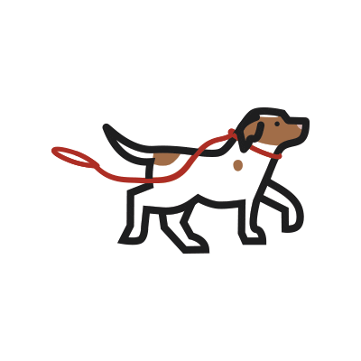

  
# Leashed
A place for pets to find a friend.

## The Project
We set out to build a scalable, user-focused MERN aplication focused on connecting pets in local areas.

## Table of Contents (clickable)
     
 * [User Stories](#user-stories)<br>
 * [Functionality](#functionality)<br>
 * [Languages Used](#languages-used)<br>
 * [APIs Used](#apis-used)<br>
 * [Deployed Application](#deployed-application)<br>
 * [Links](#links)<br>
 * [Creators](#creators)<br>
 * [License](#license)<br>
 * [Questions](#questions)<br>

 --- 

<br>

 ## User Stories
```
AS a user
I WANT an application where I can see other local pets near me
SO THAT I may connect those pets with my pet
```

<br>

---

<br>

## Functionality
* User is able to sign-up and log into their personalized account within the application
* User is able to upload a profile for their pet
* User is able to view a gallery of other pets
* User is able to comment on other pets' profiles

<br>

---

<br>

## Languages Used
* REACT for front-end
* GraphQL with Node.js & Express.js for RESTful API
* MongoDB and Mongoose ODM for database
* Queries and mutations for retrieving, adding, deleting data
* MUI for styling

<br>

---

<br>

## APIs Used
* <a href="https://cloudinary.com/documentation/upload_widget">Cloudinary Upload Widget</a><br>

<br>

---

## Deployed Application


### Links
[Project GitHub Repo](https://github.com/TeSingleton/Leashed) <br>
[Deployed Project on Heroku](PLACEHOLDER) <br>


### Creators
[Ali](https://github.com/nugemeister), [Colin](https://github.com/cplancich), [Connor](https://github.com/cmullan602), [James](https://github.com/), and [Té](https://github.com/TeSingleton)
<br>

<br>

<br>
### License

[](https://opensource.org/licenses/MIT)

Copyright 2022 TeSingleton

Permission is hereby granted, free of charge, to any person obtaining a copy of this software and associated documentation files (the "Software"), to deal in the Software without restriction, including without limitation the rights to use, copy, modify, merge, publish, distribute, sublicense, and/or sell copies of the Software, and to permit persons to whom the Software is furnished to do so, subject to the following conditions:

The above copyright notice and this permission notice shall be included in all copies or substantial portions of the Software.

THE SOFTWARE IS PROVIDED "AS IS", WITHOUT WARRANTY OF ANY KIND, EXPRESS OR IMPLIED, INCLUDING BUT NOT LIMITED TO THE WARRANTIES OF MERCHANTABILITY, FITNESS FOR A PARTICULAR PURPOSE AND NONINFRINGEMENT. IN NO EVENT SHALL THE AUTHORS OR COPYRIGHT HOLDERS BE LIABLE FOR ANY CLAIM, DAMAGES OR OTHER LIABILITY, WHETHER IN AN ACTION OF CONTRACT, TORT OR OTHERWISE, ARISING FROM, OUT OF OR IN CONNECTION WITH THE SOFTWARE OR THE USE OR OTHER DEALINGS IN THE SOFTWARE.

<br>

## Questions?

Any inquiries , feel free to reach out:

GitHub : <a href="https://github.com/TeSingleton">TeSingleton</a>

Email:  <a href="mailto:worksingletonmcdaniel@gmail.com">worksingletonmcdaniel@gmail.com</a>

---


